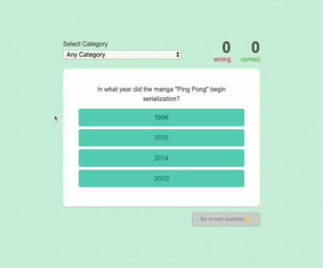

# React Quiz App 
A React Application which allows a user to choose a category and select an answer from question data which will be pulled from Open Trivia database using Trivia API.

## Demo


### Installation guide

* To locally run this web application, you need a good package manager either npm or yarn. 

* Once you've succesfully installed npm or yarn,
  - fork and clone this repository
  - CD into the folder where you cloned your fork
  - enter the command below download dependencies:
```sh
$ `yarn install` or `npm install` 
```
* Run app

```sh
$ `yarn watch` or `npm run watch` 
```
* You will see the below message in terminal if everything was successfully installed:
You can now view the app in the browser.

  Server running at: http://localhost:1234